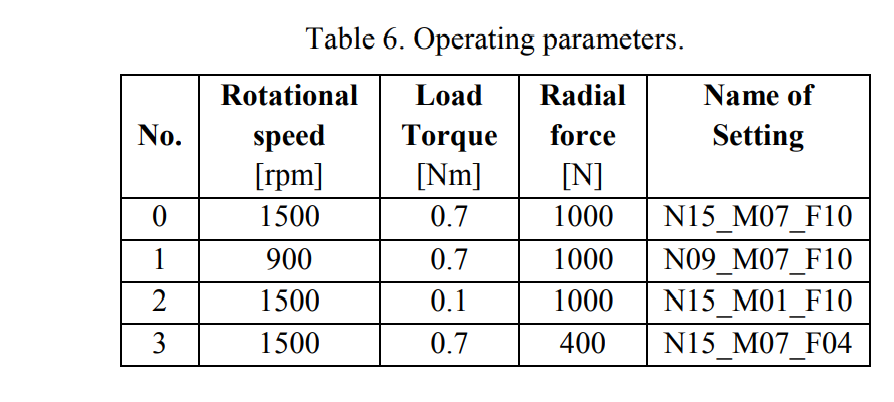
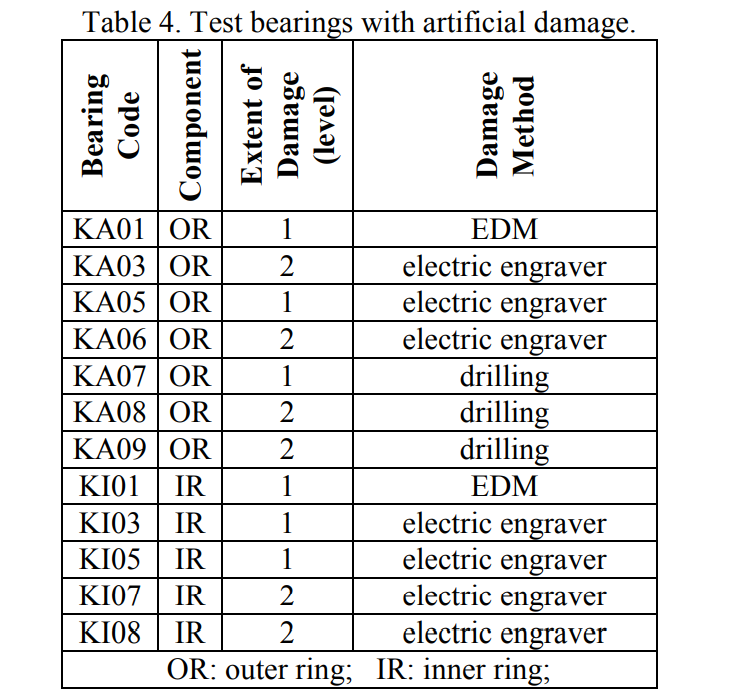
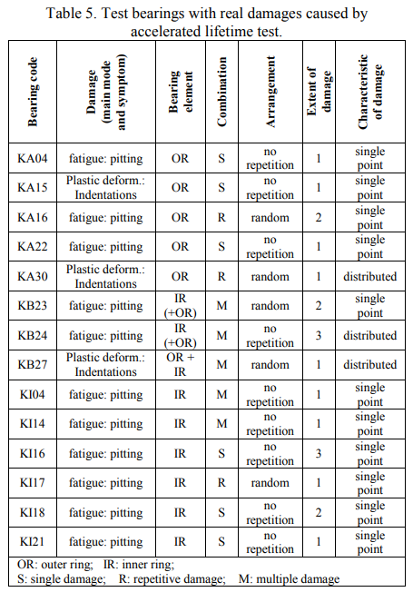

**网址**：https://mb.uni-paderborn.de/en/kat/main-research/datacenter/bearing-datacenter/data-sets-and-download  

**数据来源**：paderborn university（德国帕德博恩大学）

**数据相关文章**：

`Condition Monitoring of Bearing Damage in Electromechanical Drive Systems by Using Motor Current Signals of Electric Motors: A Benchmark Data Set for Data-Driven Classification <Condition Monitoring of Bearing Damage in Electromechanical Drive Systems by Using Motor Current Signals of Electric Motors.pdf>`_

**数据和下载**：

数据集主要的特征包括以下几个方面：

1. 同步测量了高分辨率和采样率的电机电流和振动信号，包括
   26个损坏轴承状态和6个未损坏（健康）状态用于参考。
2. 支持测量速度、扭矩、径向负载、温度。
3. 四种不同的操作工况
4. 对每种设置情况进行了20次测量，每次测量4秒，保存为了MatLab文件，
   文件命名包括了操作工况编码和四个数字的轴承编码（如N15_M07_F10_KA01_1.mat）。
5. 在统一的资料表和测量日志中对轴承损伤进行了系统描述，可以和数据一起下载。

**下载**：

总体上，在类型6203的球轴承上进行了32种不同轴承损伤的实验：

- 无损（健康）轴承（6个），见 表6_
- 人为加工故障轴承（12个），见 表4_
- 加速全寿命测试导致的真实损伤的轴承（14个），见 表5_
  
.. _表6:

   **表6 无损（健康）轴承（6个）**

.. _表4:

   **表4 人为加工故障轴承（12个）**

.. _表5:

   **表5 加速全寿命测试导致的真实损伤的轴承（14个）**

